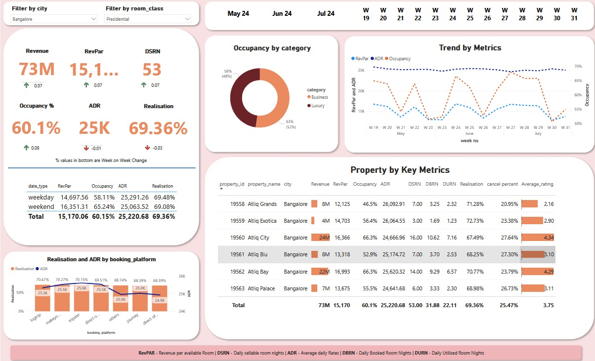

# **Hotel Analytics Dashboard**

 <!-- Replace with the link to your dashboard preview image -->

## **Project Overview**

In the competitive hospitality industry, tracking metrics like Revenue, Occupancy, ADR, and RevPAR is crucial for strategic success. This Power BI dashboard is designed to provide actionable insights with ease.

### **✨ Key Features**

- **Custom Filters**: **🔍** Sort data effortlessly by city and room class.
- **Performance Tracking**: **📈** Monitor week-on-week changes in key metrics like Revenue, Occupancy %, and ADR.
- **Comparative Analysis**: **📊** Compare weekday vs. weekend performance for strategic insights.
- **Granular Insights**: **🔬** Delve into property-specific metrics and booking platform efficiency.

### **🔧 Dashboard Features**

- **City and Room Class Filtering**: Filter and focus on specific data segments.
- **Key Performance Indicators (KPIs)**: Prominently display critical KPIs.
- **Occupancy Visualization**: Visualize occupancy rates by category.
- **Trend Analysis**: Track trends for RevPAR, ADR, and Occupancy over time.
- **Detailed Property Metrics**: In-depth metrics for individual properties.
- **Booking Platform Analysis**: Evaluate the effectiveness of different booking platforms.

## **📸 Dashboard Preview**

Here’s a glimpse of the **    Optimizing-Hotel-Performance-with-Data-Driven-Insights

** in action:

![Hotel Analytics Dashboard Screenshot(hotel.jpg) <!-- Replace with the link to your dashboard image -->

## **🛠️ Technologies Used**

- **Microsoft Excel**: For data preparation and initial analysis.
- **MySQL**: For robust data storage and retrieval.
- **Power BI**: For creating interactive and dynamic visualizations.

## **🚀 Getting Started**

1. **Clone the Repository:**
   ```bash
   git clone https://github.com/username/hotel-analytics-dashboard.git
